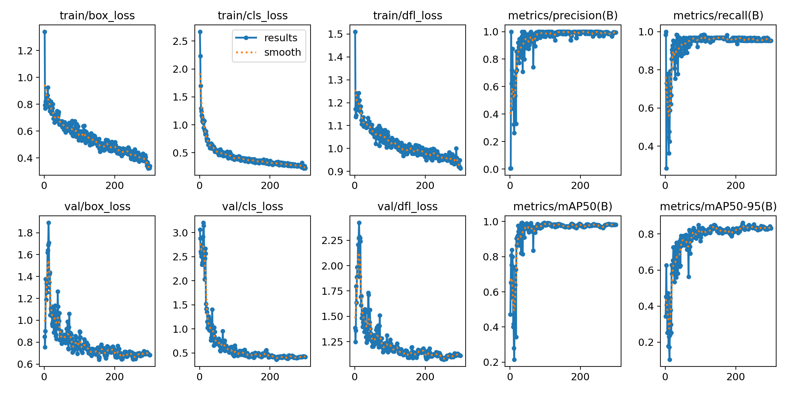

# Barcode Detection with Deep Learning (YOLOv11)
This project aims to develop a deep learning model to detect barcodes from a webcam in real-time. The model is build using [YOLOv11](https://github.com/ultralytics/ultralytics).

## Description
This model is the result of training using [YOLOv11](https://github.com/ultralytics/ultralytics), which utilizes a dataset from [Roboflow](https://roboflow.com). The project operates based on the following principles:
- It users a total of 200 barcode images (67% for the training set, 22% for the validation set, and 12% for the test set) to train the model.
- [YOLOv11](https://github.com/ultralytics/ultralytics) is employed to detect barcodes from the webcam.
- The [OpenCV](https://opencv.org) library is used to access the webcam and draw rectangles around the detected barcodes.
- The [pyzbar](https://github.com/NaturalHistoryMuseum/pyzbarope) library is used to read the values of the barcodes.



## Installation
This project is run under a virtual environment (venv) using Python version 3.9.6

Use `git clone https://github.com/Wanlop61/Barcode-Detection.git` to download the project to your computer.

#### For MacOS:
1. Use the command 
```python
source .venv/bin/activate
```
2. Run
```python
python main.py
```